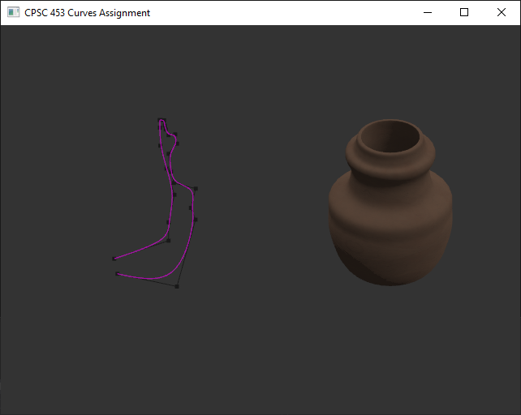
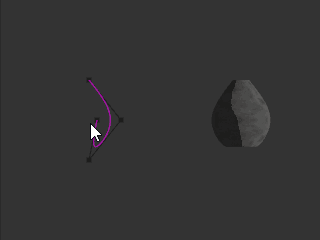

# Computer Graphics (CPSC 453) Project: Revolution Surfaces from Curves
Jackson Cougar Wiebe &bull; Fall 2019 &bull; University of Calgary

Simple demo project shows off how to create and texture a mesh create by revolving a curve about the y-axis. 
Move the control points by clicking on a vertex and dragging the mouse. 
You can also create, subdivide, and delete them using `E`, `S`, and `D` keys respectively.

## Demo (Click to play)

original link: https://www.youtube.com/watch?v=UuGpkGAGBJE

## Building with CMake

    mkdir build
    cd build
    cmake ../

## Manual
### Synopsis

    demo normal ao roughness albedo

### Options

    normal      
        filename of the normal map used when shading the surface

    ao      
        filename of the ambient occlusion map used when shading the surface

    roughness      
        filename of the roughness map used when shading the surface

    albedo      
        filename of the albedo map used when shading the surface

### Controls

    [Ctrl-S]	        saves the current model to "model.data".
    [Ctrl-L]	        loads the current model from "model.data".
    [D]			deletes the selected control point.
    [E]			copies the selected control point.
    [S]			adds a control point between the selected control point and its neighbor.

    [Left MouseButton]	selects the control point under the mouse.
    [Left MouseButton+Drag] moves the camera around the mesh viewport.

## Bonus Features implemented

- [x] Load and save the models
- [x] Improve rendering using texture mapping
- [x] Improve rendering using procedural textures

